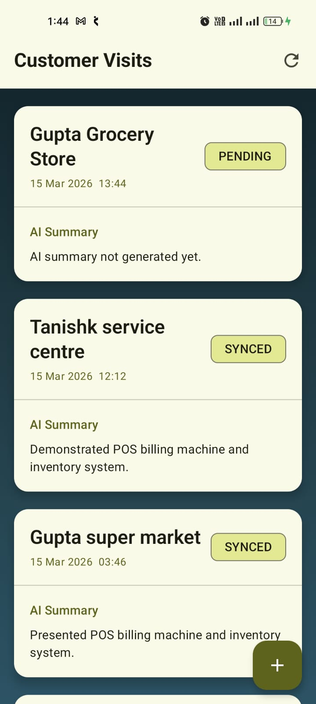
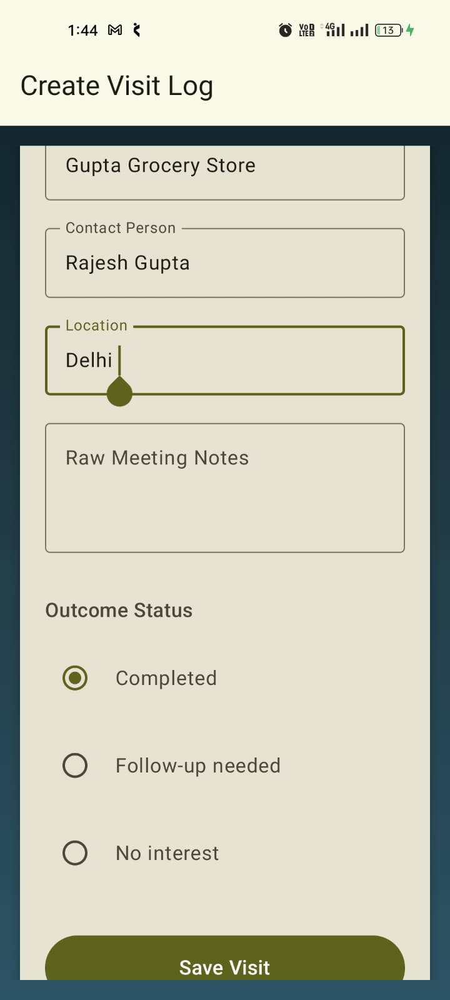
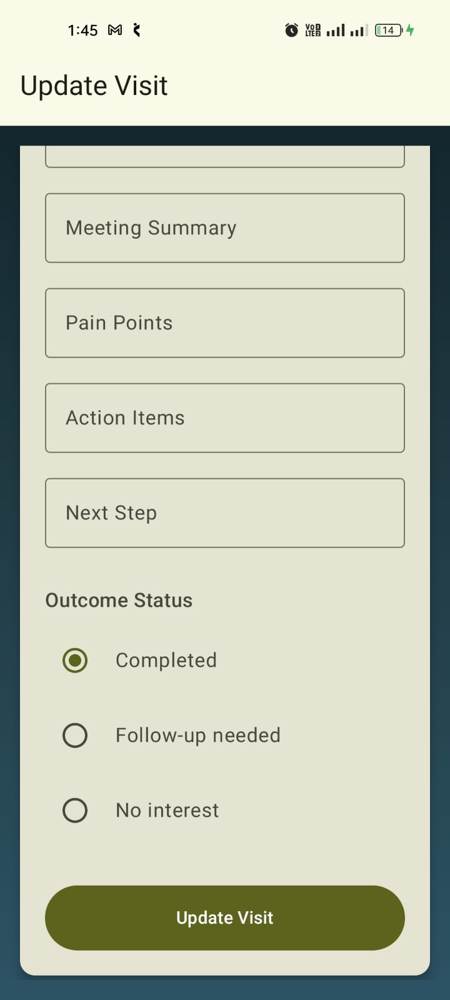

# AI Sales Visit Logger

AI Sales Visit Logger is a mobile application designed for field sales representatives to record customer visits and automatically generate structured summaries
using AI.
The application supports **offline visit logging, AI-assisted summaries, and automatic background synchronization** when internet connectivity becomes available.

---

# Features

## 1. Authentication

Users can log in using **Firebase Authentication**.

After a successful login, the user session is automatically persisted so the user does not need to log in again after restarting the application.

---

## 2. Visit List

The visit list screen displays all previously recorded customer visits.

Each visit item includes:

• Customer name  
• Visit date and time  
• AI-generated summary preview  
• Sync status indicator  

Sync status can be:

• **DRAFT** – visit created but not processed  
• **PENDING** – waiting for AI processing or upload  
• **SYNCED** – successfully uploaded to backend  
• **FAILED** – sync attempt failed and needs retry  

Users can manually trigger synchronization using the refresh button.

---

## 3. Create / Edit Visit

Sales representatives can log a customer visit with the following fields:

• Customer name  
• Contact person  
• Location  
• Raw meeting notes  
• Outcome status  
• Follow-up date  

Validation rules implemented:

• Customer name is required  
• Follow-up date is required **only when outcome is “Follow-up needed”**

Visits are saved locally first to ensure **offline support**.

---

## 4. AI Assisted Summary

The application uses **Google Gemini API** to transform raw meeting notes into structured data.

The AI generates:

• Meeting summary  
• Pain points  
• Action items  
• Recommended next step  

This allows unstructured meeting notes to become structured CRM-ready information automatically.

---

## 5. Offline Support

The application follows an **offline-first architecture**.

All visits are stored locally using **Room Database**, allowing users to:

• Create visits offline  
• Edit visits offline  
• View visit history offline  

When internet connectivity returns, pending visits are synchronized automatically.

---

## 6. Automatic Background Sync

Synchronization is handled using **Android WorkManager**.

The background worker performs the following steps:

1. Retrieves unsynced visits from the local database
2. Generates AI summaries if not already completed
3. Uploads visits to Firebase Firestore
4. Updates sync status in the local database

If any step fails, the visit remains **PENDING** so it can be retried later.

---

# Screenshots

| All_Visits | Register_Visit | Update_Visit |
|------------|--------|--------|
|  |  |  | 
---

# Tech Stack

• Kotlin  
• Jetpack Compose  
• MVVM Architecture  
• Clean Architecture  
• Room Database  
• Firebase Authentication  
• Firebase Firestore  
• WorkManager  
• Retrofit  
• OkHttp  
• Google Gemini API  
• Koin (Dependency Injection)

---

## Project Architecture

The application follows **MVVM + Clean Architecture** to ensure separation of concerns, scalability, and testability.

### Architecture Layers

presentation/
UI layer built using Jetpack Compose and ViewModels.  
ViewModels manage UI state and interact with domain use cases.

domain/
Contains business logic including:
- UseCases
- Domain models
- Repository interfaces

data/
Implements repository interfaces and handles data sources:
- Room Database (local persistence)
- Firebase Firestore (backend)
- Gemini API (AI summaries)

common/
Shared utilities such as:
- ResultState
- SyncManager
- WorkManager sync scheduler

---

### MVVM Flow

The UI follows the MVVM pattern:

UI (Compose Screens)  
↓  
ViewModel  
↓  
UseCase  
↓  
Repository  
↓  
Data Source (Room / Firebase / Gemini API)

ViewModels expose StateFlows that are collected by Compose UI using `collectAsStateWithLifecycle()`.

This ensures reactive UI updates and lifecycle-aware state management.

---

# Setup Instructions

## 1 Clone the Repository
        git clone https://github.com/adityasharma455/ai-sales-visit-logger
---

## 2 Open the Project

Open the project in **Android Studio**.

---

## 3 Add Gemini API Key

Create or edit **local.properties** in the project root:
    API_KEY=YOUR_GEMINI_API_KEY
This key is used for generating AI summaries.

---

### 4 Firebase Setup

Create a Firebase project and enable:

- Firebase Authentication
- Cloud Firestore

Download `google-services.json` and place it inside: app/

---

### 5 Build and Run

Run the application using an Android device or emulator.

---

## AI Summary Example

Raw Notes:

"Customer is interested in upgrading CRM system but concerned about integration cost."

AI Output:

Meeting Summary:
Customer is evaluating CRM upgrade.

Pain Points:
Concern about integration cost.

Action Items:
Provide pricing proposal.

Recommended Next Step:
Schedule follow-up meeting with technical team.

---

## Offline Sync Flow

1 User creates visit offline  
2 Visit stored in Room database  
3 AI processing occurs when internet available  
4 Visit uploaded to Firebase  
5 Sync status updated to SYNCED

---

👨‍💻 Author

Aditya Sharma
🎓 3rd Year Computer Science Student
📱 Android Developer | Kotlin | Jetpack Compose 

🔗 GitHub: https://github.com/adityasharma455

