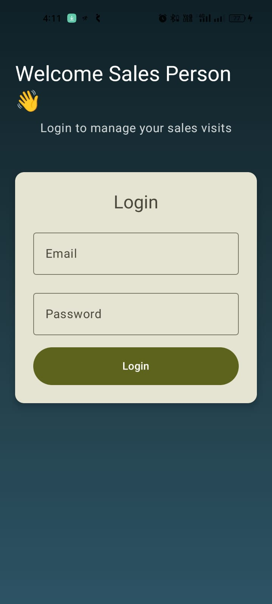
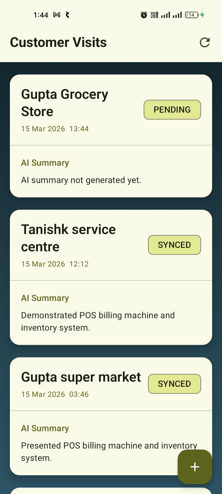
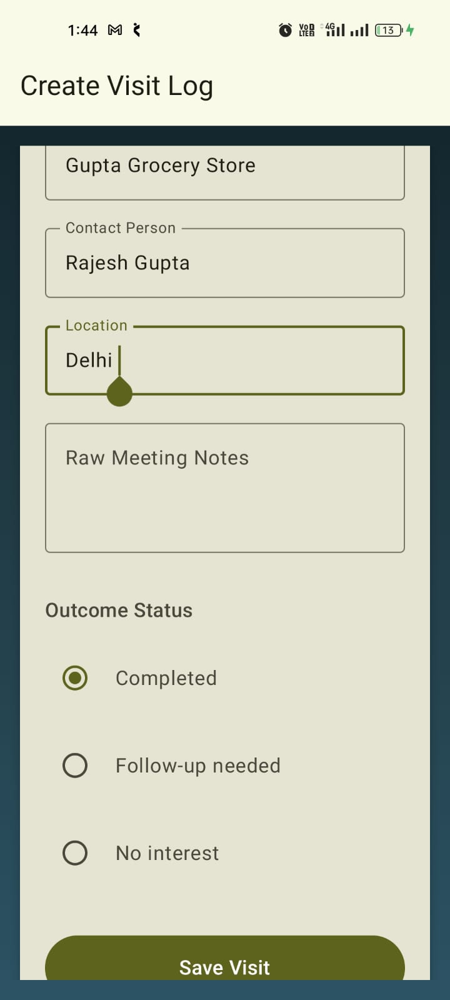
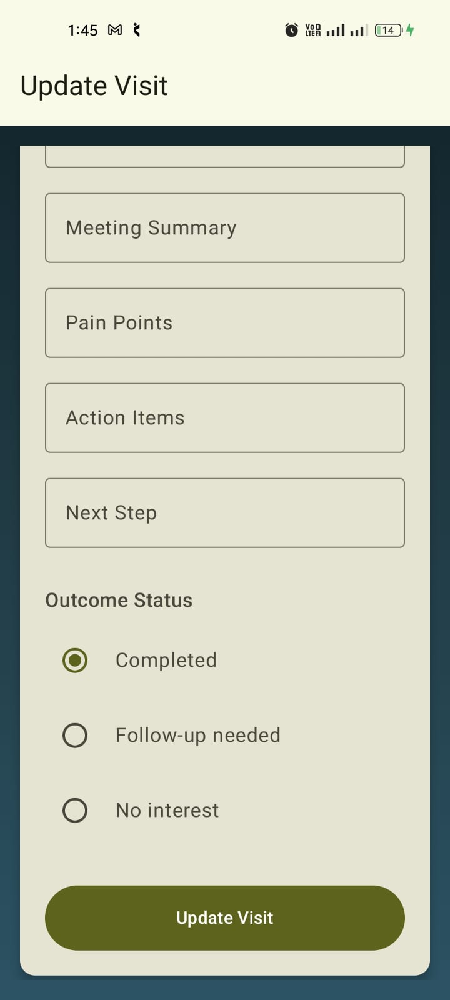
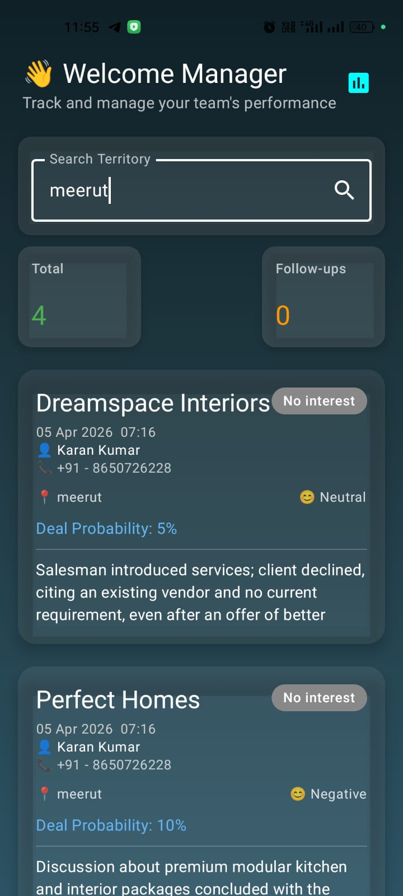
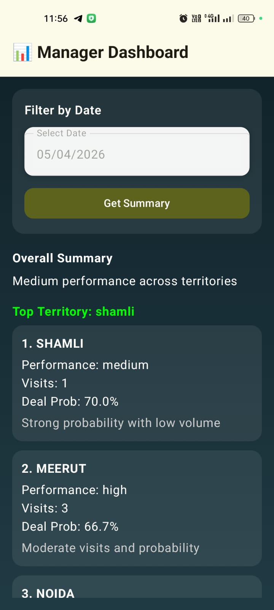

# AI Sales Visit Logger

AI Sales Visit Logger is an offline-first mobile application built for field sales teams and managers to record customer visits, convert unstructured meeting notes into structured CRM-ready summaries using AI, and sync data automatically when internet becomes available.

The app supports both **sales representative workflow** and **manager workflow**.

---

## Key Features

### 1) Authentication
- Firebase Authentication for login
- User session persists after app restart
- Secure access to app features after successful sign-in

### 2) Visit Logging
Sales representatives can create and update visit entries with:
- Customer name
- Contact person
- Customer email
- Territory
- Location
- Raw meeting notes
- Outcome status
- Follow-up date
- Optional audio recording

Validation rules:
- Customer name is required
- Contact person is required
- Location is required
- Customer email must be valid
- Territory is required
- Follow-up date is required only when outcome is **Follow-up needed**

### 3) Audio Recording + Speech-to-Text
The app now supports voice-based note capture:
- Record customer conversation
- Save audio locally
- Transcribe audio into text using **Sarvam AI Speech-to-Text**
- Append transcription into visit notes

This helps sales reps capture notes faster during field visits.

### 4) AI-Assisted Visit Summary
The app uses **Google Gemini API** to transform raw notes into structured data.

AI generates:
- Meeting Summary
- Pain Points
- Action Items
- Recommended Next Step
- Customer Emotion
- Deal Probability
- Suggested Strategy

This makes visit data more useful for CRM and reporting.

### 5) Offline-First Support
All visits are stored locally using **Room Database** so users can:
- Create visits offline
- Edit visits offline
- View visit history offline

Pending visits are synchronized later when connectivity returns.

### 6) Automatic Background Sync
Synchronization is handled using **WorkManager**.

Background sync flow:
1. Fetch unsynced visits from Room
2. Generate AI summary if needed
3. Upload visit to Firebase Firestore
4. Update sync status in local database

Sync states used in the app:
- **DRAFT** – visit created locally
- **PENDING** – waiting for AI or upload
- **SYNCED** – uploaded successfully
- **FAILED** – sync failed and can be retried

### 7) Manager Dashboard
A separate manager section is available for monitoring team activity.

Manager can:
- View all territory visits
- Search visits by territory
- Open visit detail screen
- View sales person info
- See total visits and follow-ups
- Open date-wise summary dashboard

### 8) Date-Wise Summary Screen
The manager summary screen shows:
- Overall summary
- Top territory
- Territory performance ranking
- Visit counts
- Average deal probability
- Insights
- Actions

---

## Tech Stack
- Kotlin
- Jetpack Compose
- MVVM Architecture
- Clean Architecture
- Room Database
- Firebase Authentication
- Firebase Firestore
- WorkManager
- Retrofit
- OkHttp
- Google Gemini API
- Sarvam AI Speech-to-Text
- Koin for Dependency Injection

---

## Project Architecture

The project follows **MVVM + Clean Architecture** for separation of concerns, scalability, and testability.

### Layers

#### `presentation/`
UI layer built with Jetpack Compose and ViewModels.

#### `domain/`
Contains:
- Use cases
- Repository interfaces
- Domain models

#### `data/`
Contains concrete implementations for:
- Room local storage
- Firebase Firestore
- Gemini AI integration
- Sarvam AI speech-to-text integration

#### `common/`
Shared utilities such as:
- `ResultState`
- AI prompt helpers
- Audio recorder utility
- Playback helper
- Sync helpers

---

## Main App Flow

### Sales Representative Flow
UI → ViewModel → UseCase → Repository → Local DB / AI / Firestore

### Manager Flow
UI → ViewModel → UseCase → Repository → Firestore / Local DB

---

## Screens Included

### Sales Screens
- Login Screen
- Visit List Screen
- Create Visit Screen
- Update Visit Screen

### Manager Screens
- Manager Visit List Screen
- Manager Visit Detail Screen
- Manager Summary Screen

---

## Screenshots

| Login Screen | All Visits |
|---|---|
|  |  |

| Register Visit | Update Visit |
|---|---|
|  |  |

| Manager Dashboard | Manager Summary |
|---|---|
|  |  |

---

## Setup Instructions

## 1 Clone the Repository
        git clone https://github.com/adityasharma455/ai-sales-visit-logger
---

## 2 Open the Project

Open the project in **Android Studio**.

---

## 3 Add Gemini API Key

Create or edit **local.properties** in the project root:
    API_KEY=YOUR_GEMINI_API_KEY
This key is used for generating AI summaries.

---

## 4 Add Sarvam API Key

Add your Sarvam AI key securely in local.properties too:

SARVAM_API_KEY=YOUR_SARVAM_API_KEY

Important: do not hardcode API keys inside source files. Keep them in local.properties or another secure build-time configuration.
---

### 5 Firebase Setup

Create a Firebase project and enable:

- Firebase Authentication
- Cloud Firestore

Download `google-services.json` and place it inside: app/

---

### 6 Build and Run

Run the application using an Android device or emulator.

---

## AI Summary Example

Raw Notes:

"Customer is interested in upgrading CRM system but concerned about integration cost."

AI Output:

Meeting Summary:
Customer is evaluating CRM upgrade.

Pain Points:
Concern about integration cost.

Action Items:
Provide pricing proposal.

Recommended Next Step:
Schedule follow-up meeting with technical team.

---

## Offline Sync Flow

1 User creates a visit offline
2 Visit is stored in Room database
3 Audio can be recorded and transcribed later
4 AI summary is generated when available
5 Visit is uploaded to Firestore
6 Sync status is updated to SYNCED
7 Notes for Development
8 Use StateFlow for UI state
9 Use collectAsStateWithLifecycle() in Compose
10 Keep business logic inside ViewModels / UseCases
11 Keep API keys out of GitHub
12 Use one repository structure for both sales and manager modules

---

👨‍💻 Author

Aditya Sharma
🎓 3rd Year Computer Science Student
📱 Android Developer | Kotlin | Jetpack Compose 

🔗 GitHub: https://github.com/adityasharma455

